# Hi 👋, I'm Tim

  

### Expert Android Developer | Jetpack Compose | Clean Architecture

---

### 📊 Activity & Metrics

  

  

---

### 🛠 Tech Stack & Tools

  
  
  
  
  

---

### 🔗 Connect with me

